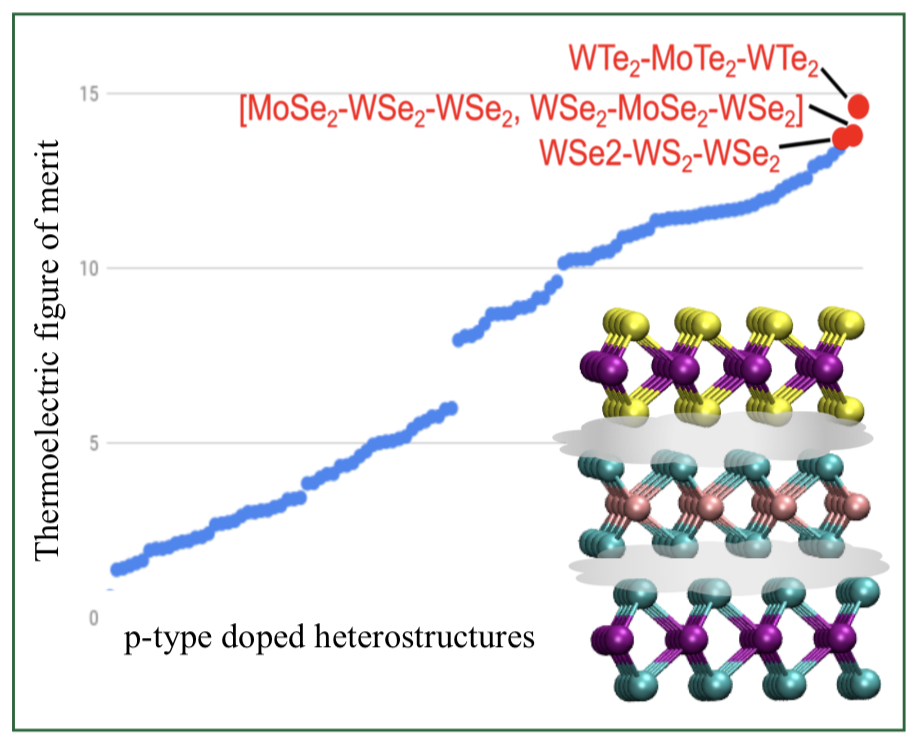

# Active Learning for Accelerated Design of Layered Materials
Bassman, L., Rajak, P., et al., *npj Computational Materials* **4**, 74 (2018).




Hetero-structures made from vertically stacked monolayers of transition metal dichalcogenides hold great potential for thermoelectric devices of the future. Discovery of the optimal layered material for specific applications necessitates the estimation of key material properties, however, screening of properties via brute force ab initio calculations of the entire material structure space exceeds the limits of current computing resources. Moreover, the functional dependence of material properties on the structures is often complicated, making simplistic statistical procedures for prediction difficult to employ without large amounts of data collection.  This repository includes Gaussian process regression code (predict_maxval.py, predict_structure.py) for prediction of band gap, conduction band minimum dispersion curve, valance band maximum dispersion curve, and Thermoelectic EFF vs. dopant concentration curve.  It also includes Bayesian optimization code (Bayesian_opt.py) to predict the best thermoelectric material using the fewest structure calculations.  Data sets for all codes are also included.  Desciptions of the codes and datasets, as well as how to run the code, are given below.  Python code (snl_prep.py) is also included for automatically generating a structure file for a given layered material and uploading it to the Materials Project Database, along with a bash script (create-[X]layers.sh) for automatically generating and uploading all 3-layered materials using 'snl_prep.py'.

<br>

#### 1 ```predict_maxval.py:```
*A Gaussian Process Regression model to predict band gap.* 

predict_maxval.py: creates a gaussian process regression model using x% of data from 3-layer-band_gap.txt. After buiding the model predcits the band gap of the remaining (1-x%) data as test set. <br />

*Dataset* <br /> 
```3-layer-band_gap.txt``` CBM and VBM 3-layer heretero-structure <br /> 
```xaxisvalue.txt```   Contains the value of the wave vector 

*Input Paramaters:* <br /> 
inputfile_name="3-layer-band_gap.txt"    * ###file name of the input data * <br />
train_test_split=0.60                    * ###split between training and test set* <br />
Nrun = 1    <br />

To run the program: ```predict_maxval.py ``` <br /> 

#### 2 ```predict_structure.py:```
*A Gaussian Process Regression model to predict conduction band maxima, valance band minima and Thermoelectic EFF function.*

predict_structure.py build a gaussian process (GP) regression model for condunction band minima and valance band maximum. It takes 3-layer-band_structure.txt as inout data and split in into training and test set. GP model is build using training set and the images of prediced condunction band minima and valance band maximum of the test set is saved in folder Bandstructure.

*Dataset* <br /> 
```"3-layer-band_structure.txt``` Band gap for 3-layer heretero-structure <br /> 

*Input Paramaters:* <br /> 
inputfile_name="3-layer-band_structure.txt"    * ###file name of the input data * <br />
train_test_split=0.60                    * ###split between training and test set* <br />
Nrun = 1    <br />

To run the program: ```predict_structure.py ``` <br /> 

#### 3 ```Bayesian_opt.py:``` 
*An active learning model, based on Bayesian Optimization, to discover material with optimal property witn minimum structure evalulation*

*Dataset* <br /> 
```N_doped_EFF_max.txt ```  EFF (Electronic fitness function) maximum value for n-doped 3-layer heretero-structure <br /> 
```P_doped_EFF_max.txt ```  EFF (Electronic fitness function) maximum value for p-doped 3-layer heretero-structure  <br /> 
```3-layer-band_gap.txt ``` Maximum Band gap for 3-layer heretero-structure <br /> 

*Input Paramaters:* <br /> 
Inside the code Bayesian_opt.py, we have <br /> 
Nruns = 1                  * ### total number of Bayesian  Optimization runs* <br /> 
train_test_split=0.10      * ### initial sampled data in a given Bayesian  Optimization run* <br /> 


*To find n-doped 3-ayer hetero-structure with optimal EFF value* <br /> 
Run ```python3.6 Bayesian_opt.py N_doped_EFF_max ``` <br /> 
*To find p-doped 3-ayer hetero-structure with optimal EFF value* <br /> 
Run ```python3.6 Bayesian_opt.py P_doped_EFF_max ``` <br /> 
*To find maximum band gap* <br />
Run ```python3.6 Bayesian_opt.py 3-layer-band_gap.txt``` <br /> 


#### 4 ```snl_prep.py:```
*Given a layered crystal structure as a string, the python script generates a structure file and uploads it to the Materials Project Database*

For example, for the 4-layered heterostructure MoTe2-MoS2-WS2-WTe2, type:

python snl_prep.py -s MoTe2-MoS2-WS2-WTe2 -d . 

The -s parameter is the structure of the layers encoded in a string. It must be formatted by the above way, but it could be any number of layers instead of just 4. The -d parameter specifies the base directory in which the newly created structure file should be placed, either absolute or relative to the pwd.

#### 5 ```create-[X]layers.sh:```
*Bash code for automatically generating all **unique** 2-, 3-, and 4-layered TMDC heterostructures and uploading them to MP Database by repeated use of the above python code, snl_prep.py. snl_prep.py is assumed to be in the same directory as the bash script*

To run, type one of the following:

bash create-2layers.sh
bash create-3layers.sh
bash create-4layers.sh


